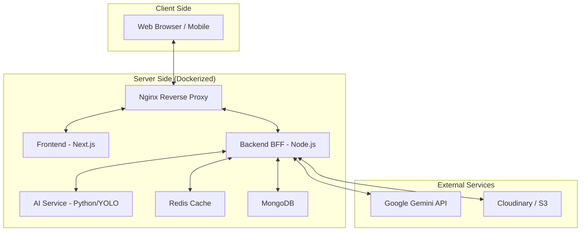

# DogDex AI - Ứng dụng nhận dạng giống chó thông minh

> **Đề tài Khóa Luận Tốt Nghiệp:** Tìm hiểu thuật toán Object Detection và xây minhminhdựng ứng dụng xác định giống chó nuôi.
>
> **Mã đề tài:** KLCN_TH030 | **GVHD:** ThS. Trần Đình Toàn

## 📖 Giới thiệu

**DogDex AI** là một ứng dụng web full-stack hiện đại, tích hợp Trí tuệ nhân tạo (AI) để nhận dạng giống chó từ hình ảnh, video và camera trực tiếp. Không chỉ dừng lại ở việc nhận dạng, hệ thống còn cung cấp một hệ sinh thái phong phú với các tính năng như "DogDex" (từ điển giống chó cá nhân), hỏi đáp với AI (tích hợp Google Gemini), và các tiện ích cộng đồng.

Dự án được xây dựng với kiến trúc **Monorepo**, kết hợp **Backend-for-Frontend (BFF)** và **Microservices**, đảm bảo tính mở rộng và hiệu năng cao.

## ✨ Tính năng nổi bật

*   **🔍 Nhận dạng đa phương thức:** Hỗ trợ nhận dạng qua ảnh, video tải lên hoặc camera trực tiếp (Real-time).
*   **📚 DogDex Collection:** Tự động lưu trữ và quản lý bộ sưu tập các giống chó người dùng đã khám phá.
*   **🤖 Trợ lý AI thông minh:** Tích hợp Google Gemini để trả lời mọi thắc mắc về chăm sóc, dinh dưỡng và huấn luyện chó.
*   **🏆 Hệ thống thành tích:** Gamification với các danh hiệu và bảng xếp hạng dựa trên hoạt động của người dùng.
*   **📱 Giao diện hiện đại:** Thiết kế Responsive, hỗ trợ Dark Mode, tối ưu trải nghiệm trên cả Mobile và Desktop.
*   **🛡️ Quản trị mạnh mẽ:** Dashboard chi tiết cho Admin để quản lý người dùng, dữ liệu huấn luyện và hệ thống.

## 🛠️ Công nghệ sử dụng

| Hạng mục | Công nghệ |
| :--- | :--- |
| **Frontend** | Next.js 14, TypeScript, Tailwind CSS, Shadcn/ui, Zustand, React Query |
| **Backend** | Node.js, Express, TypeScript, MongoDB (Mongoose), Redis, BullMQ |
| **AI Service** | Python, PyTorch, YOLO (Object Detection), FastAPI |
| **DevOps** | Docker, Docker Compose, Nginx |
| **3rd Party** | Google Gemini API, Cloudinary (Media Storage) |

## ⚡ Tối ưu hiệu năng (Production-Ready)

Hệ thống được tối ưu hóa toàn diện để đảm bảo khả năng chịu tải cao và bảo mật:

| Tối ưu | Công nghệ | Mô tả |
| :--- | :--- | :--- |
| **Cache Stampede Prevention** | Redis Mutex | Chỉ 1 request tính toán khi cache miss, các request khác chờ |
| **Rate Limiting** | Redis Store | Giới hạn request phân tán, persist qua restart |
| **Video Processing Queue** | BullMQ (Redis) | Xử lý video bất đồng bộ, không mất job khi restart |
| **AI Response Caching** | Redis (7 ngày) | Giảm chi phí gọi Google Gemini API |
| **Real-time Updates** | WebSocket Push | Thay thế polling, giảm tải server |
| **Security Headers** | Helmet | Bảo mật HTTP headers chuẩn OWASP |
| **Compression** | Gzip | Giảm 70-80% dung lượng response |
| **Auth Security** | HTTP-only Cookie | RefreshToken an toàn, chống XSS |
| **Database Indexing** | MongoDB Indexes | Tối ưu query cho các trường hay truy vấn |

## 🏗️ Kiến trúc hệ thống



## 🚀 Hướng dẫn cài đặt

Bạn có thể chạy dự án bằng Docker (khuyên dùng) hoặc chạy thủ công từng service.

### Yêu cầu tiên quyết

*   **Git**
*   **Docker & Docker Compose** (nếu chạy bằng Docker)
*   **Node.js v18+** & **Python 3.9+** (nếu chạy thủ công)

### Bước 1: Clone dự án

```bash
git clone https://github.com/username/DogBreedID_v2.git
cd DogBreedID_v2
```

### Bước 2: Cấu hình môi trường

Tạo file `.env` tại thư mục gốc và cấu hình các biến môi trường cần thiết (tham khảo `.env.example`).

```bash
cp .env.example .env
# Chỉnh sửa file .env với thông tin database, API key của bạn
```

### Bước 3: Chạy dự án

#### Cách 1: Sử dụng Docker (Khuyên dùng)

Chỉ cần một lệnh duy nhất để khởi chạy toàn bộ hệ thống:

```bash
docker-compose up --build -d
```

Sau khi khởi động thành công:
*   **Frontend:** `http://localhost:3000`
*   **Backend:** `http://localhost:5000`
*   **AI Service:** `http://localhost:8000`

#### Cách 2: Chạy thủ công (Development)

**1. Backend:**

```bash
cd backend
npm install
npm run dev
```

**2. Frontend:**

```bash
cd frontend
npm install
npm run dev
```

**3. AI Service:**

```bash
cd ai_service
pip install -r requirements.txt
python main.py
```

## 📂 Cấu trúc thư mục

```
DogBreedID_v2/
├── ai_service/         # Service xử lý nhận dạng ảnh (Python)
├── backend/            # Backend API & Logic nghiệp vụ (Node.js)
├── frontend/           # Giao diện người dùng (Next.js)
├── doc/                # Tài liệu dự án
├── docker-compose.yml  # Cấu hình Docker
└── README.md           # Tài liệu hướng dẫn
```

## 👥 Nhóm thực hiện

**Sinh viên thực hiện:**
1.  Lương Liêm Phong (2001223664)
2.  Văn Trọng Dương (2001220817)
3.  Trần Khánh Vũ (2001225914)

**Giảng viên hướng dẫn:** ThS. Trần Đình Toàn

---
© 2024 DogDex AI. All rights reserved.
